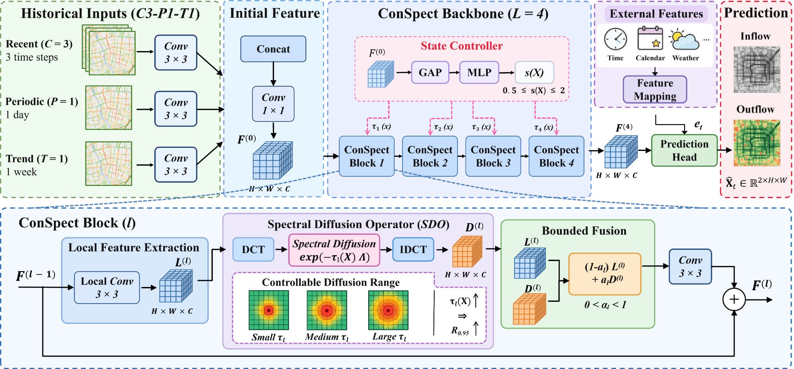

# ConSpect

**ConSpect: A Controllable Concentric Diffusion Network for Citywide Flow Prediction**

ConSpect is a citywide grid-based flow prediction model designed around a simple spatial question: **how far should spatial information propagate from a target region?**

Local spatial modeling provides reliable information from nearby regions, but a fixed local range may omit useful information from farther surrounding areas. Expanding the spatial range indiscriminately, however, may introduce distant regions that are only weakly related to the target. ConSpect addresses this problem by formulating nonlocal spatial modeling as a **target-centered, near-to-far controllable concentric diffusion process**.

Starting from local spatial representations, ConSpect performs diffusion in the spectral domain and adjusts the diffusion scale according to the current traffic sample. This produces a **sample-specific effective diffusion range**, allowing different inputs to use different spatial ranges. The resulting diffusion features are then integrated with the local pathway through **bounded fusion**, so that nonlocal information complements local prediction in a controlled manner.

## Model Overview

<p align="center">
  
</p>

<p align="center"><em>Overall architecture of ConSpect and the structure of a ConSpect Block.</em></p>

ConSpect uses the **C3-P1-T1** historical input configuration:

- **Closeness (C = 3):** the three most recent time slots.
- **Period (P = 1):** the corresponding time slot from the previous day.
- **Trend (T = 1):** the corresponding time slot from the previous week.

The three temporal inputs are first processed by independent `3 × 3` convolutions. Their features are concatenated and fused by a `1 × 1` convolution to obtain the initial representation $F^{(0)}$. The shared backbone contains **four ConSpect Blocks**.

Each ConSpect Block contains three main components:

### 1. Local Feature Extraction

A local `3 × 3` convolution extracts reliable neighborhood-level spatial information and forms the local representation $L^{(l)}$.

### 2. Spectral Diffusion Operator

ConSpect introduces nonlocal information through continuous spatial diffusion on the regular urban grid. The diffusion operation is implemented in the Laplacian spectral domain:

```text
DCT → spectral diffusion exp(-τ_l(X) Λ) → IDCT
```

The diffusion scale $\tau_l(X)$ determines how far information propagates outward from the target region. Small diffusion scales concentrate the response near the target, while larger scales extend the response toward more distant concentric regions.

We characterize this propagation using the **effective diffusion range** $R_{0.95}$, defined as the smallest Chebyshev range containing 95% of the normalized diffusion response.

### 3. State-Adaptive Range Control and Bounded Fusion

A shared state controller extracts a sample-level representation from $F^{(0)}$ using global average pooling and an MLP. It generates a modulation factor $s(X)$, bounded between `0.5` and `2`, which adjusts the base diffusion scale of each ConSpect Block:

```text
τ_l(X) = τ̄_l · s(X)
```

This allows different traffic samples to form different effective diffusion ranges.

The local and diffusion features are then combined using a learnable bounded coefficient $\alpha_l$:

```text
Z^(l) = (1 - α_l) L^(l) + α_l D^(l),    0 < α_l < 1
```

External features are mapped independently and fused at the prediction stage before producing the final two-channel citywide flow field.

## Main Results

ConSpect is evaluated on two real-world citywide grid-based flow datasets, **TaxiBJ** and **BikeNYC**. Prediction errors are measured after inverse normalization over all test samples, both flow channels, and all grid cells.

| Dataset | RMSE | MAE |
|---|---:|---:|
| TaxiBJ | **16.067 ± 0.094** | **9.524 ± 0.052** |
| BikeNYC | **5.122 ± 0.046** | **2.631 ± 0.023** |

Relative to the best competing results reported in the manuscript, ConSpect reduces RMSE by **3.73%** on TaxiBJ and **19.08%** on BikeNYC, while also reducing MAE by **5.42%** and **26.71%**, respectively.

The experiments further show that:

- continually enlarging a fixed diffusion range does not consistently reduce prediction error;
- different traffic samples prefer different spatial ranges;
- state-adaptive diffusion forms sample-dependent effective diffusion ranges;
- controlled integration of local and diffused information improves citywide flow prediction.

## Repository Structure

```text
ConSpect/
├── assets/
│   └── conspect_architecture.png    # Main architecture figure
├── configs/
│   ├── TaxiBJ/                      # TaxiBJ configurations
│   └── BikeNYC/                     # BikeNYC configurations
├── conspect/
│   ├── model.py                     # ConSpect model
│   ├── trainer.py                   # Training and validation logic
│   ├── training_protocol.py        # Loss, optimizer, and scheduler
│   ├── analysis/                    # Effective diffusion-range utilities
│   ├── dataset/                     # Dataset loading and preprocessing
│   └── utils/
├── datasets/
│   ├── TaxiBJ/
│   └── BikeNYC/
├── tests/                           # Lightweight model tests
├── train.py                         # Main training entry point
├── requirements.txt
└── pyproject.toml
```

## Environment

The experiments were implemented in PyTorch. The manuscript reports the following primary environment:

```text
Python 3.12.12
PyTorch 2.10.0+cu128
CUDA 12.8
```

Install the required Python packages with:

```bash
pip install -r requirements.txt
```

If GPU acceleration is required, install the PyTorch build matching your local CUDA environment before installing the remaining dependencies.

## Datasets

Raw datasets are not redistributed in this repository. Please obtain TaxiBJ and BikeNYC from their original or authorized sources and place the files under the following directories.

### TaxiBJ

```text
datasets/TaxiBJ/
├── BJ13_M32x32_T30_InOut.h5
├── BJ14_M32x32_T30_InOut.h5
├── BJ15_M32x32_T30_InOut.h5
├── BJ16_M32x32_T30_InOut.h5
├── BJ_Holiday.txt
└── BJ_Meteorology.h5
```

TaxiBJ uses a `32 × 32` spatial grid with 30-minute intervals. The two prediction channels correspond to **inflow** and **outflow**. External features include time, holiday, and weather information.

### BikeNYC

```text
datasets/BikeNYC/
└── NYC14_M16x8_T60_NewEnd.h5
```

BikeNYC uses a `16 × 8` spatial grid with 60-minute intervals. The two prediction channels correspond to **new-flow** and **end-flow**. The external feature is time information.

## Training

The released model uses four ConSpect Blocks (`L = 4`) and 64 hidden channels. The main optimization settings are:

- Smooth L1 loss with `beta = 1`
- AdamW optimizer
- learning rate `1e-3`
- weight decay `0.05`
- OneCycleLR
- maximum learning rate `2e-3`
- warm-up fraction `0.10`
- batch size `32`
- best-checkpoint selection by validation RMSE
- early stopping patience of `30` epochs

The current release configuration files use `100` maximum epochs.

### TaxiBJ

```bash
python train.py configs/TaxiBJ/L4-R3/config.ini --seed 0
```

### BikeNYC

```bash
python train.py configs/BikeNYC/L4-R3/config.ini --seed 0
```

For the five-run evaluation protocol, use seeds:

```text
0, 1, 2, 3, 4
```

## Evaluation Protocol

The datasets are divided chronologically into training, validation, and test sets.

- Training data are used to learn model parameters and compute normalization statistics.
- Validation RMSE is used to select the best checkpoint.
- The test set is used only for final prediction-error evaluation.
- RMSE and MAE are computed after inverse normalization over all samples, both flow channels, and all grid cells.

## Effective Diffusion Range Analysis

The `conspect.analysis` package contains utilities for analyzing the spatial extent of spectral diffusion. The effective diffusion range follows the manuscript definition based on Chebyshev distance and the smallest range containing a specified proportion of the normalized diffusion response, with `ρ = 0.95` used in the experiments.

## Tests

Architecture-level tests can be executed without the datasets:

```bash
python -m unittest discover -s tests -v
```

A short data-backed smoke run can be executed after the datasets are placed locally:

```bash
python train.py configs/TaxiBJ/L4-R3/config.ini --smoke-test --epochs 1
```

## Citation

If you use this code in your research, please cite the corresponding ConSpect paper. The complete bibliographic information will be added after publication.

```bibtex
@article{conspect,
  title   = {ConSpect: A Controllable Concentric Diffusion Network for Citywide Flow Prediction},
  note    = {Manuscript under review}
}
```

## License

No open-source license is currently included. Please add the license approved by the authors or institution before public release if redistribution rights are intended.
